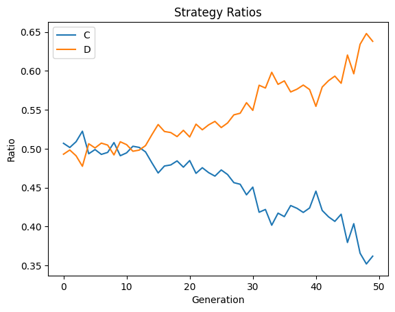

## 囚人のジレンマゲームにおける遺伝的アルゴリズムを用いた生物進化のシミュレーション
有限繰り返し囚人のジレンマゲームを行う生物の集団を遺伝的アルゴリズムを用いてシミュレーションするプログラム．
集団の中で個体が他とどのような関係を持ち，社会を形成していくかを観察することを目的とする．

## 遺伝的アルゴリズムの設定
| 用語 | 設定 |
|------|------|
| 適応度 | 有限繰り返し囚人のジレンマゲームの平均利得 |
| 戦略の選択方法 | それまでの自分と相手の戦略を入力とするRNN |
| 遺伝子 | RNNの重み |
| 選択 | エリート選択 + ルーレット選択（重複なし） |
| 交叉 | BLX-α |
| 突然変異 | 遺伝子の一部に正規分布に従う乱数を加算 |

## 結果

集団数30，突然変異率0.1，エリート選択率0.1，ルーレット選択率0.4，BLX-αのα=0.5で実行した結果．
横軸は世代数，縦軸は協力（C）または裏切り（D）の割合を表す．

世代を重ねるごとに，裏切りを選択する個体が増えていくことがわかる．すなわち，今回のシミュレーションでは，囚人のジレンマゲームのナッシュ均衡である敵対関係が形成されていくことがわかる．